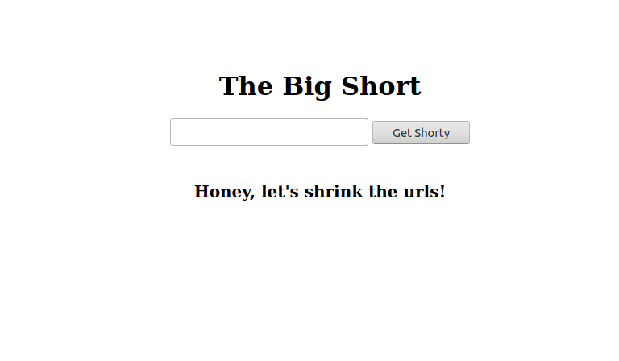

> This project is a take-home assessment. The task was to build a URL shortener. I have used StimulusJS / Rails / PostgreSQL to set up a key-value database system of unique short URL keys for each unique URL, as well as for storing user data for each click and each short-url creator.

# The Big Short 

## Project Description

This project is a simple URL shortener designed to account for variances in http:// and www. beginnings to common URLs. While https:// and http:// are stored separately, www.google.com and google.com are not. Each unique URL is assigned a 10 character key. Each 10 character key is randomly generated from upper and lower case letters, as well as all digits. Inputting the exact same URL will return the same short key every time. Key collisions are prevented through a recursive key generator.

#### Features
-   Responsive minimalist layout works well on mobile or desktop
-   Stores data each time a short URL is used 
-   Stores data each time a short URL is created - including double entries
-   Stores 'http://' and 'https://' as separate entries
-   Adds 'http://' as default if it is not included
-   Scrubs 'www.' from beginning of address to store www.domain.com and domain.com as the same entry
-   Serves as Open API - Requests can send a URL in the body params and have a short key returned.

###### Coming Features

-   Short URL reverse lookup
-   Invalid URL error handling

## Built With

-   Ubuntu / Atom
-   Front-End: ERB / SCSS / StimulusJS
-   Back-End: Ruby / Rails / PostgreSQL

### To Use The App
-   To shorten a URL type it into the input box and click "Get Shorty"
-   Click the link that appears below the input to copy the short URL to your clipboard
-   Post that URL anywhere you want for an easy to share link to any web reachable resource!

### To Use The API 
-   Send a `POST` request to `https://www.ur-shorty.herokuapp.com/app`
-   Receive a `short` key in the response
-   Append this key to the `ur-shorty.herokuapp.com/` domain and be redirected!

## Live Demo

Click the [Live Link](https://ur-shorty.herokuapp.com/) to visit this site now!

## Getting Started

**To get this project set up on your local machine, follow these simple steps:**
#### Prerequisites

-   Ruby: 2.7.2
-   Rails: 6

#### Setup

**Step 1** 
Navigate to the local folder where you want the repository to be cloned and run
`git clone https://github.com/defoebrand/Chunin-Exam.git`. 

**Step 2** 
Next, run `cd Chunin-Exam`. 

**Step 3** 
Run `bundle install` to install or update necessary gems. 

**Step 4** 
Run `rails db:setup` to create the database and load the schema. 

**Step 5** 
Run `rails s` to begin the server. 

**Step 6** 
You will have to adjust all instances of 'domain' to reflect the local setup. Check line 39 of the input_controller.js file, as well as relevant views spec files: line 9 of spec/views/with_input_spec.rb & line 20 of spec/views/without_input_spec.rb. 

**Step 7** 
Navigate to `http://localhost:3000/` in a browser of your choice to see the application running 

### Testing
This project uses RSpec and Capybara for testing.
> To run tests open a terminal inside the project's root directory and enter `rspec`

## Author

👤 **Brandon Defoe**

-   Portfolio: [defoebrand](https://www.defoebrand.com)
-   LinkedIn: [@defoebrand](https://www.linkedin.com/in/defoebrand/)
-   Github: [@defoebrand](https://github.com/defoebrand)

## Show your support

If you've read this far....give us a ⭐️!

## :clap: Acknowledgments

-   [@EmirVatric](https://github.com/EmirVatric)
